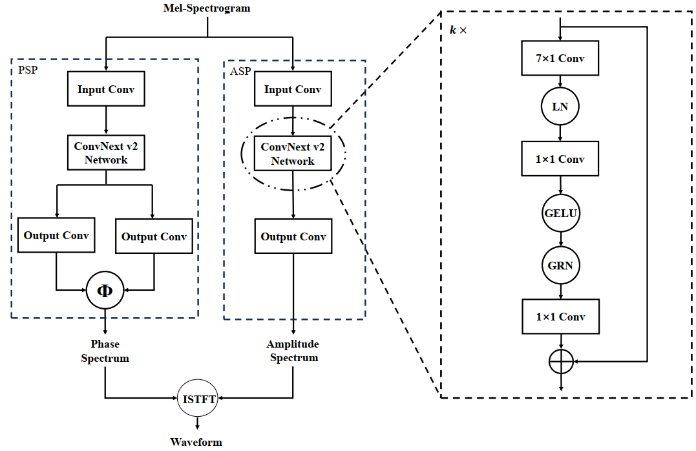
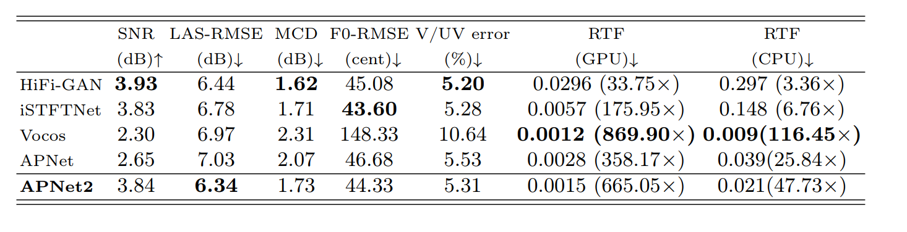

# APNet2: High-quality and High-efficiency Neural Vocoder with Direct Prediction of Amplitude and Phase Spectra
### Hui-Peng Du, Ye-Xin Lu, Yang Ai, Zhen-Hua Ling
In our [paper](https://arxiv.org/pdf/2311.11545.pdf), we proposed APNet2: High-quality and High-efficiency Neural Vocoder with Direct Prediction of Amplitude and Phase Spectra.<br>
We provide our implementation as open source in this repository.

**Abstract:** 
In our previous work, we proposed a neural vocoder called APNet, which directly predicts speech amplitude and phase spectra with a 5 ms frame shift in parallel from the input acoustic features, and then reconstructs the 16 kHz speech waveform using inverse short-time Fourier transform (ISTFT). 
APNet demonstrates the capability to generate synthesized speech of comparable quality to the HiFi-GAN vocoder but with a considerably improved inference speed.
However, the performance of the APNet vocoder is constrained by the waveform sampling rate and spectral frame shift, limiting its practicality for high-quality speech synthesis.
Therefore, this paper proposes an improved iteration of APNet, named APNet2. 
The proposed APNet2 vocoder adopts ConvNeXt v2 as the backbone network for amplitude and phase predictions, expecting to enhance the modeling capability.
Additionally, we introduce a multi-resolution discriminator (MRD) into the GAN-based losses and optimize the form of certain losses.
At a common configuration with a waveform sampling rate of 22.05 kHz and spectral frame shift of 256 points (i.e., approximately 11.6ms), our proposed APNet2 vocoder outperformed the original APNet and Vocos vocoders in terms of synthesized speech quality. 
The synthesized speech quality of APNet2 is also comparable to that of HiFi-GAN and iSTFTNet, while offering a significantly faster inference speed.

Audio samples can be found [here](https://redmist328.github.io/APNet2_demo/).<br>

## Requirements
Follow this [txt](https://github.com/redmist328/APNet2/requirements.txt).

## Training
```
python train.py 
```
Checkpoints and copy of the configuration file are saved in the `cp_APNet` directory by default.<br>
You can modify the training and inference configuration by modifying the parameters in the [config.json](https://github.com/redmist328/APNet2/config.json).
## Inference
You can download pretrained model on LJSpeech dataset at [here](http://home.ustc.edu.cn/~redmist/APNet2/).
```
python inference.py
```

## Model Structure


## Comparison with other models


## Acknowledgements
We referred to [HiFiGAN](https://github.com/jik876/hifi-gan), [NSPP](https://github.com/YangAi520/NSPP), [APNet](https://github.com/YangAi520/APNet) 
and [Vocos](https://github.com/charactr-platform/vocos) to implement this.

## Citation
```
soon
```
