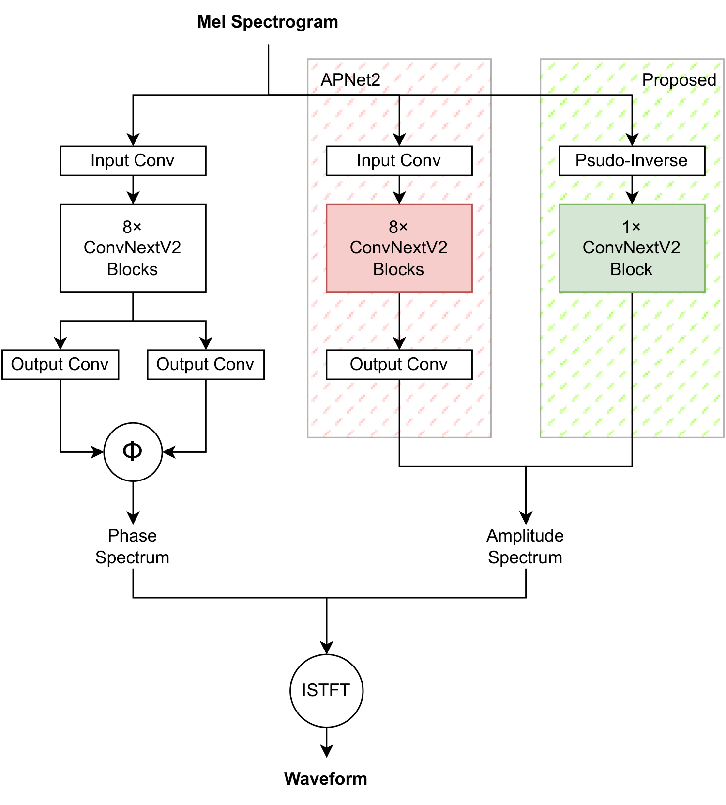

# FreeV: Free Lunch For Vocoders Through Pseudo Inversed Mel Filter

## Anonymous submission to InterSpeech 2024

------

### Table of contents
 * [Abstract](#abstract)
 * [Reconstruction](#reconstruction)
 * [TTS](#tts)
 * [References](#references)

### Abstract

Vocoders reconstruct speech waveforms from acoustic features and play a pivotal role in modern TTS systems. Frequent-domain GAN vocoders like Vocos and APNet2 have recently seen rapid advancements, outperforming time-domain models in inference speed while achieving comparable audio quality. However, these frequency-domain vocoders suffer from large parameter sizes, thus introducing extra memory burden. Inspired by PriorGrad and SpecGrad, we employ pseudo-inverse to estimate the amplitude spectrum as the initialization roughly. This simple initialization significantly mitigates the parameter demand for vocoder. Based on APNet2 and our streamlined Amplitude prediction branch, we propose our FreeV, compared with its counterpart APNet2, our FreeV achieves **1.8**$\times$ inference speed improvement with nearly **half parameters**. Meanwhile, our FreeV outperforms APNet2 in resynthesis quality, marking a step forward in pursuing real-time, high-fidelity speech synthesis.

------

### Reconstruction

<table>
<tr>
<th>Ground Truth</th>
<th>FreeV (Proposed)</th>
<th>APNet2</th>
<th>HiFiGAN</th>
<th>HiFiGAN w/pinv</th>
<th>ISTFTNet</th>
<th>ISTFTNet w/pinv</th>
<th>vocos</th>
</tr>
<tr>
<td><audio controls preload="none"><source src="audios/resyn/origin/LJ001-0072.wav" type="audio/mp3">Your browser does not support the audio element.</audio></td>
<td><audio controls preload="none"><source src="audios/resyn/freev/LJ001-0072.wav" type="audio/mp3">Your browser does not support the audio element.</audio></td>
<td><audio controls preload="none"><source src="audios/resyn/apnet/LJ001-0072.wav" type="audio/mp3">Your browser does not support the audio element.</audio></td>
<td><audio controls preload="none"><source src="audios/resyn/hifigan/LJ001-0072.wav" type="audio/mp3">Your browser does not support the audio element.</audio></td>
<td><audio controls preload="none"><source src="audios/resyn/hifigan_inv/LJ001-0072.wav" type="audio/mp3">Your browser does not support the audio element.</audio></td>
<td><audio controls preload="none"><source src="audios/resyn/istft/LJ001-0072.wav" type="audio/mp3">Your browser does not support the audio element.</audio></td>
<td><audio controls preload="none"><source src="audios/resyn/istft_inv/LJ001-0072.wav" type="audio/mp3">Your browser does not support the audio element.</audio></td>
<td><audio controls preload="none"><source src="audios/resyn/vocos/LJ001-0072.wav" type="audio/mp3">Your browser does not support the audio element.</audio></td>
</tr>
<tr>
<td><audio controls preload="none"><source src="audios/resyn/origin/LJ001-0173.wav" type="audio/mp3">Your browser does not support the audio element.</audio></td>
<td><audio controls preload="none"><source src="audios/resyn/freev/LJ001-0173.wav" type="audio/mp3">Your browser does not support the audio element.</audio></td>
<td><audio controls preload="none"><source src="audios/resyn/apnet/LJ001-0173.wav" type="audio/mp3">Your browser does not support the audio element.</audio></td>
<td><audio controls preload="none"><source src="audios/resyn/hifigan/LJ001-0173.wav" type="audio/mp3">Your browser does not support the audio element.</audio></td>
<td><audio controls preload="none"><source src="audios/resyn/hifigan_inv/LJ001-0173.wav" type="audio/mp3">Your browser does not support the audio element.</audio></td>
<td><audio controls preload="none"><source src="audios/resyn/istft/LJ001-0173.wav" type="audio/mp3">Your browser does not support the audio element.</audio></td>
<td><audio controls preload="none"><source src="audios/resyn/istft_inv/LJ001-0173.wav" type="audio/mp3">Your browser does not support the audio element.</audio></td>
<td><audio controls preload="none"><source src="audios/resyn/vocos/LJ001-0173.wav" type="audio/mp3">Your browser does not support the audio element.</audio></td>
</tr>
<tr>
<td><audio controls preload="none"><source src="audios/resyn/origin/LJ002-0171.wav" type="audio/mp3">Your browser does not support the audio element.</audio></td>
<td><audio controls preload="none"><source src="audios/resyn/freev/LJ002-0171.wav" type="audio/mp3">Your browser does not support the audio element.</audio></td>
<td><audio controls preload="none"><source src="audios/resyn/apnet/LJ002-0171.wav" type="audio/mp3">Your browser does not support the audio element.</audio></td>
<td><audio controls preload="none"><source src="audios/resyn/hifigan/LJ002-0171.wav" type="audio/mp3">Your browser does not support the audio element.</audio></td>
<td><audio controls preload="none"><source src="audios/resyn/hifigan_inv/LJ002-0171.wav" type="audio/mp3">Your browser does not support the audio element.</audio></td>
<td><audio controls preload="none"><source src="audios/resyn/istft/LJ002-0171.wav" type="audio/mp3">Your browser does not support the audio element.</audio></td>
<td><audio controls preload="none"><source src="audios/resyn/istft_inv/LJ002-0171.wav" type="audio/mp3">Your browser does not support the audio element.</audio></td>
<td><audio controls preload="none"><source src="audios/resyn/vocos/LJ002-0171.wav" type="audio/mp3">Your browser does not support the audio element.</audio></td>
</tr>
<tr>
<td><audio controls preload="none"><source src="audios/resyn/origin/LJ003-0140.wav" type="audio/mp3">Your browser does not support the audio element.</audio></td>
<td><audio controls preload="none"><source src="audios/resyn/freev/LJ003-0140.wav" type="audio/mp3">Your browser does not support the audio element.</audio></td>
<td><audio controls preload="none"><source src="audios/resyn/apnet/LJ003-0140.wav" type="audio/mp3">Your browser does not support the audio element.</audio></td>
<td><audio controls preload="none"><source src="audios/resyn/hifigan/LJ003-0140.wav" type="audio/mp3">Your browser does not support the audio element.</audio></td>
<td><audio controls preload="none"><source src="audios/resyn/hifigan_inv/LJ003-0140.wav" type="audio/mp3">Your browser does not support the audio element.</audio></td>
<td><audio controls preload="none"><source src="audios/resyn/istft/LJ003-0140.wav" type="audio/mp3">Your browser does not support the audio element.</audio></td>
<td><audio controls preload="none"><source src="audios/resyn/istft_inv/LJ003-0140.wav" type="audio/mp3">Your browser does not support the audio element.</audio></td>
<td><audio controls preload="none"><source src="audios/resyn/vocos/LJ003-0140.wav" type="audio/mp3">Your browser does not support the audio element.</audio></td>
</tr>
<tr>
<td><audio controls preload="none"><source src="audios/resyn/origin/LJ005-0086.wav" type="audio/mp3">Your browser does not support the audio element.</audio></td>
<td><audio controls preload="none"><source src="audios/resyn/freev/LJ005-0086.wav" type="audio/mp3">Your browser does not support the audio element.</audio></td>
<td><audio controls preload="none"><source src="audios/resyn/apnet/LJ005-0086.wav" type="audio/mp3">Your browser does not support the audio element.</audio></td>
<td><audio controls preload="none"><source src="audios/resyn/hifigan/LJ005-0086.wav" type="audio/mp3">Your browser does not support the audio element.</audio></td>
<td><audio controls preload="none"><source src="audios/resyn/hifigan_inv/LJ005-0086.wav" type="audio/mp3">Your browser does not support the audio element.</audio></td>
<td><audio controls preload="none"><source src="audios/resyn/istft/LJ005-0086.wav" type="audio/mp3">Your browser does not support the audio element.</audio></td>
<td><audio controls preload="none"><source src="audios/resyn/istft_inv/LJ005-0086.wav" type="audio/mp3">Your browser does not support the audio element.</audio></td>
<td><audio controls preload="none"><source src="audios/resyn/vocos/LJ005-0086.wav" type="audio/mp3">Your browser does not support the audio element.</audio></td>
</tr>
<tr>
<td><audio controls preload="none"><source src="audios/resyn/origin/LJ006-0084.wav" type="audio/mp3">Your browser does not support the audio element.</audio></td>
<td><audio controls preload="none"><source src="audios/resyn/freev/LJ006-0084.wav" type="audio/mp3">Your browser does not support the audio element.</audio></td>
<td><audio controls preload="none"><source src="audios/resyn/apnet/LJ006-0084.wav" type="audio/mp3">Your browser does not support the audio element.</audio></td>
<td><audio controls preload="none"><source src="audios/resyn/hifigan/LJ006-0084.wav" type="audio/mp3">Your browser does not support the audio element.</audio></td>
<td><audio controls preload="none"><source src="audios/resyn/hifigan_inv/LJ006-0084.wav" type="audio/mp3">Your browser does not support the audio element.</audio></td>
<td><audio controls preload="none"><source src="audios/resyn/istft/LJ006-0084.wav" type="audio/mp3">Your browser does not support the audio element.</audio></td>
<td><audio controls preload="none"><source src="audios/resyn/istft_inv/LJ006-0084.wav" type="audio/mp3">Your browser does not support the audio element.</audio></td>
<td><audio controls preload="none"><source src="audios/resyn/vocos/LJ006-0084.wav" type="audio/mp3">Your browser does not support the audio element.</audio></td>
</tr>
<tr>
<td><audio controls preload="none"><source src="audios/resyn/origin/LJ007-0076.wav" type="audio/mp3">Your browser does not support the audio element.</audio></td>
<td><audio controls preload="none"><source src="audios/resyn/freev/LJ007-0076.wav" type="audio/mp3">Your browser does not support the audio element.</audio></td>
<td><audio controls preload="none"><source src="audios/resyn/apnet/LJ007-0076.wav" type="audio/mp3">Your browser does not support the audio element.</audio></td>
<td><audio controls preload="none"><source src="audios/resyn/hifigan/LJ007-0076.wav" type="audio/mp3">Your browser does not support the audio element.</audio></td>
<td><audio controls preload="none"><source src="audios/resyn/hifigan_inv/LJ007-0076.wav" type="audio/mp3">Your browser does not support the audio element.</audio></td>
<td><audio controls preload="none"><source src="audios/resyn/istft/LJ007-0076.wav" type="audio/mp3">Your browser does not support the audio element.</audio></td>
<td><audio controls preload="none"><source src="audios/resyn/istft_inv/LJ007-0076.wav" type="audio/mp3">Your browser does not support the audio element.</audio></td>
<td><audio controls preload="none"><source src="audios/resyn/vocos/LJ007-0076.wav" type="audio/mp3">Your browser does not support the audio element.</audio></td>
</tr>
<tr>
<td><audio controls preload="none"><source src="audios/resyn/origin/LJ010-0219.wav" type="audio/mp3">Your browser does not support the audio element.</audio></td>
<td><audio controls preload="none"><source src="audios/resyn/freev/LJ010-0219.wav" type="audio/mp3">Your browser does not support the audio element.</audio></td>
<td><audio controls preload="none"><source src="audios/resyn/apnet/LJ010-0219.wav" type="audio/mp3">Your browser does not support the audio element.</audio></td>
<td><audio controls preload="none"><source src="audios/resyn/hifigan/LJ010-0219.wav" type="audio/mp3">Your browser does not support the audio element.</audio></td>
<td><audio controls preload="none"><source src="audios/resyn/hifigan_inv/LJ010-0219.wav" type="audio/mp3">Your browser does not support the audio element.</audio></td>
<td><audio controls preload="none"><source src="audios/resyn/istft/LJ010-0219.wav" type="audio/mp3">Your browser does not support the audio element.</audio></td>
<td><audio controls preload="none"><source src="audios/resyn/istft_inv/LJ010-0219.wav" type="audio/mp3">Your browser does not support the audio element.</audio></td>
<td><audio controls preload="none"><source src="audios/resyn/vocos/LJ010-0219.wav" type="audio/mp3">Your browser does not support the audio element.</audio></td>
</tr>
</table>

### TTS

Synthesized from opensource [FastSpeech](https://github.com/ming024/FastSpeech2)

<table>
<tr>
<th>FreeV (Proposed)</th>
<th>APNet2</th>
<th>HiFiGAN</th>
<th>HiFiGAN w/pinv</th>
<th>ISTFTNet</th>
<th>ISTFTNet w/pinv</th>
<th>vocos</th>
</tr>
<tr>
<td><audio controls preload="none"><source src="audios/tts/freev/LJ003-0193.wav" type="audio/mp3">Your browser does not support the audio element.</audio></td>
<td><audio controls preload="none"><source src="audios/tts/apnet/LJ003-0193.wav" type="audio/mp3">Your browser does not support the audio element.</audio></td>
<td><audio controls preload="none"><source src="audios/tts/hifigan/LJ003-0193.wav" type="audio/mp3">Your browser does not support the audio element.</audio></td>
<td><audio controls preload="none"><source src="audios/tts/hifigan_inv/LJ003-0193.wav" type="audio/mp3">Your browser does not support the audio element.</audio></td>
<td><audio controls preload="none"><source src="audios/tts/istft/LJ003-0193.wav" type="audio/mp3">Your browser does not support the audio element.</audio></td>
<td><audio controls preload="none"><source src="audios/tts/istft_inv/LJ003-0193.wav" type="audio/mp3">Your browser does not support the audio element.</audio></td>
<td><audio controls preload="none"><source src="audios/tts/vocos/LJ003-0193.wav" type="audio/mp3">Your browser does not support the audio element.</audio></td>
</tr>
<tr>
<td><audio controls preload="none"><source src="audios/tts/freev/LJ005-0014.wav" type="audio/mp3">Your browser does not support the audio element.</audio></td>
<td><audio controls preload="none"><source src="audios/tts/apnet/LJ005-0014.wav" type="audio/mp3">Your browser does not support the audio element.</audio></td>
<td><audio controls preload="none"><source src="audios/tts/hifigan/LJ005-0014.wav" type="audio/mp3">Your browser does not support the audio element.</audio></td>
<td><audio controls preload="none"><source src="audios/tts/hifigan_inv/LJ005-0014.wav" type="audio/mp3">Your browser does not support the audio element.</audio></td>
<td><audio controls preload="none"><source src="audios/tts/istft/LJ005-0014.wav" type="audio/mp3">Your browser does not support the audio element.</audio></td>
<td><audio controls preload="none"><source src="audios/tts/istft_inv/LJ005-0014.wav" type="audio/mp3">Your browser does not support the audio element.</audio></td>
<td><audio controls preload="none"><source src="audios/tts/vocos/LJ005-0014.wav" type="audio/mp3">Your browser does not support the audio element.</audio></td>
</tr>
<tr>
<td><audio controls preload="none"><source src="audios/tts/freev/LJ006-0109.wav" type="audio/mp3">Your browser does not support the audio element.</audio></td>
<td><audio controls preload="none"><source src="audios/tts/apnet/LJ006-0109.wav" type="audio/mp3">Your browser does not support the audio element.</audio></td>
<td><audio controls preload="none"><source src="audios/tts/hifigan/LJ006-0109.wav" type="audio/mp3">Your browser does not support the audio element.</audio></td>
<td><audio controls preload="none"><source src="audios/tts/hifigan_inv/LJ006-0109.wav" type="audio/mp3">Your browser does not support the audio element.</audio></td>
<td><audio controls preload="none"><source src="audios/tts/istft/LJ006-0109.wav" type="audio/mp3">Your browser does not support the audio element.</audio></td>
<td><audio controls preload="none"><source src="audios/tts/istft_inv/LJ006-0109.wav" type="audio/mp3">Your browser does not support the audio element.</audio></td>
<td><audio controls preload="none"><source src="audios/tts/vocos/LJ006-0109.wav" type="audio/mp3">Your browser does not support the audio element.</audio></td>
</tr>
<tr>
<td><audio controls preload="none"><source src="audios/tts/freev/LJ006-0123.wav" type="audio/mp3">Your browser does not support the audio element.</audio></td>
<td><audio controls preload="none"><source src="audios/tts/apnet/LJ006-0123.wav" type="audio/mp3">Your browser does not support the audio element.</audio></td>
<td><audio controls preload="none"><source src="audios/tts/hifigan/LJ006-0123.wav" type="audio/mp3">Your browser does not support the audio element.</audio></td>
<td><audio controls preload="none"><source src="audios/tts/hifigan_inv/LJ006-0123.wav" type="audio/mp3">Your browser does not support the audio element.</audio></td>
<td><audio controls preload="none"><source src="audios/tts/istft/LJ006-0123.wav" type="audio/mp3">Your browser does not support the audio element.</audio></td>
<td><audio controls preload="none"><source src="audios/tts/istft_inv/LJ006-0123.wav" type="audio/mp3">Your browser does not support the audio element.</audio></td>
<td><audio controls preload="none"><source src="audios/tts/vocos/LJ006-0123.wav" type="audio/mp3">Your browser does not support the audio element.</audio></td>
</tr>
</table>

### References
1. APNet2 [Paper](https://arxiv.org/pdf/2311.11545.pdf) [Code(Official)](https://github.com/redmist328/APNet2)
2. HiFiGAN [Paper](https://arxiv.org/abs/2010.05646) [Code(Official)](https://github.com/jik876/hifi-gan)
3. iSTFTNet [Paper](https://arxiv.org/pdf/2203.02395.pdf) [Code(Reproduced)](https://github.com/rishikksh20/iSTFTNet-pytorch)
4. Vocos [Paper](https://arxiv.org/abs/2306.00814) [Code(Official)](https://github.com/gemelo-ai/vocos)
5. FastSpeech2 [Paper](https://arxiv.org/abs/2006.04558v1) [Code(Reproduced)](https://github.com/ming024/FastSpeech2)