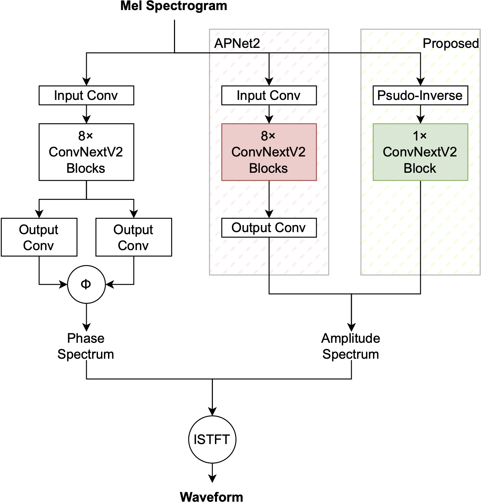
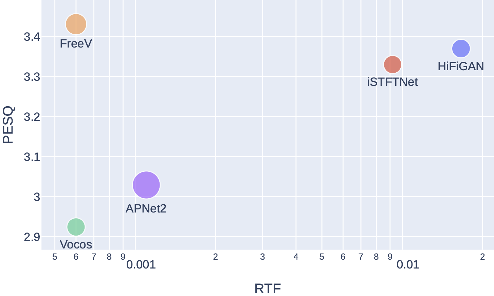
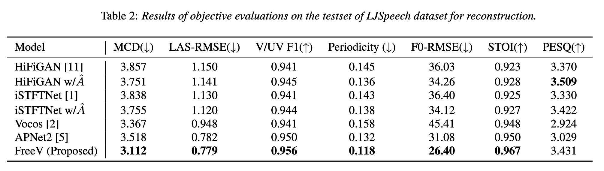

# FreeV: Free Lunch For Vocoders Through Pseudo Inversed Mel Filter

One liner code:
```python
model_input = (mel_spec @ mel_filter.pinverse()).abs().clamp_min(1e-5)
```

Official Repository of the paper: [FreeV: Free Lunch For Vocoders Through Pseudo Inversed Mel Filter](https://arxiv.org/abs/2406.08196)

**Audio samples** at: [https://bakerbunker.github.io/FreeV/](https://bakerbunker.github.io/FreeV/)

**Model checkpoints** and **tensorboard training logs** available at: [huggingface](https://huggingface.co/Bakerbunker/FreeV_Model_Logs)

## Requirements
```bash
git clone https://github.com/BakerBunker/FreeV.git
cd FreeV
pip install -r requirements.txt
```

## Configs

I tried using [PGHI(Phase Gradient Heap Integration)](https://ieeexplore.ieee.org/stamp/stamp.jsp?arnumber=7890450) as phase spec initialization. But sadly it didn't work.

Here is the config and train script of different settings, `diff <train-script> <train-script>` to see the differences.

| Model | Config File | Train Script | 
| --- | ---| ---|
|APNet2|config.json|train.py|
|APNet2 w/pghi|config_pghi.json|train_pghi.py|
|FreeV | config2.json|train2.py|
|FreeV w/pghi| config2_pghi.json|train2_pghi.py|

## Training
```
python <train-script>
```
Checkpoints and copy of the configuration file are saved in the `checkpoint_path` directory in `config.json`.

Modify the training and inference configuration by modifying the parameters in the `config.json`.

## Inference
Download pretrained model on LJSpeech dataset at [huggingface](https://huggingface.co/Bakerbunker/FreeV_Model_Logs).

Modify the `inference.py` to inference.


## Model Structure


## Comparison with other models




## Acknowledgements
We referred to [APNet2](https://github.com/redmist328/APNet2) to implement this.

See the code changes at this [commit](https://github.com/BakerBunker/FreeV/commit/95e1e5cb3fe2b0360a30f39167e3e3ffd8097980)

## Citation
```bibtex
@misc{lv2024freevfreelunchvocoders,
      title={FreeV: Free Lunch For Vocoders Through Pseudo Inversed Mel Filter}, 
      author={Yuanjun Lv and Hai Li and Ying Yan and Junhui Liu and Danming Xie and Lei Xie},
      year={2024},
      eprint={2406.08196},
      archivePrefix={arXiv},
      primaryClass={cs.SD},
      url={https://arxiv.org/abs/2406.08196}, 
}
```
